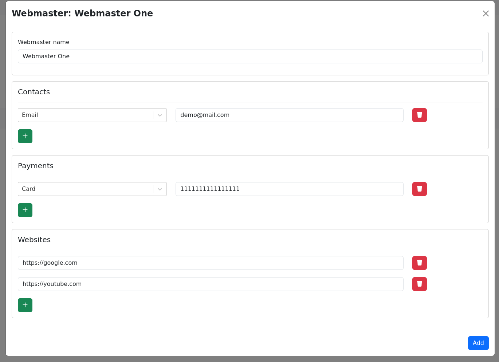

<p align="center">
    
</p>

<hr />

<p align="center">
	<a href="https://github.com/alexmudrak/webmaster-helper/actions/workflows/ci-backend.yaml" target="_blank">
    
	</a>
</p>

<hr />

## Webmaster Helper

**Webmaster Helper** is a comprehensive CRM system designed to streamline and
organize your interactions with website owners. It facilitates the management
of relevant contacts, allowing you to add projects and link contacts from
fellow webmasters, while keeping a detailed record of dates and interaction
content.

## Features

In addition, the system offers the capability to verify metrics and conduct a
comprehensive evaluation of collaboration effectiveness. Data is gathered from
reputable websites, including __Similarweb, Moz, Yandex X, and Web Archive__.

<p align="center">
    
</p>

The system's automation feature simplifies the process of checking for the
presence of placed links. After deploying promotional materials, you can
conduct a real-time check to ensure the inclusion of a link to your project on
the webmaster's site.

<p align="center">
    
</p>

Experience enhanced efficiency and control in your webmaster collaborations
with Webmaster Helper.

## Tools Requirment

- git
- docker
- docker-compose

## How to run

- Obtain the latest project code: `git clone <REPO_URL>`
- Navigate to the downloaded directory
- Copy the environment variable file: `cp .env.example .env`

Edit the `.env` file. You need to come up with and record the main settings:

_MANDATORY_
```markdown
# MAIN
APP_ENV=PROD              # System operating mode
APP_SECRET_KEY=           # IMPORTANT: Encryption secret key

# DATABASE
APP_DB_NAME=              # Database name
APP_DB_USER=              # Database user login
APP_DB_PASS=              # Database user password

# CREDENTIALS
ADMIN_USER=               # Administrator login, will be created during installation
ADMIN_PASSWORD=           # Administrator password, will be created during installation
```

It is also recommended to set up
_ADDITIONAL_
```markdown
# PROXY
PROXY_SERVER=             # Proxy server
PROXY_USERNAME=           # Proxy server login
PROXY_PASSWORD=           # Proxy server password
```

After setting the mandatory parameters, run:
- `docker-compose up -d --build`

Once all containers are ready, go to:

- `http://localhost/`

Admin panel:

- `http://localhost/admin/`

You Awesome !

## Recommended requirements

- 4GB Disk
- 2 CPU
- 1 GB RAM

## Tech stack

| Backent | Frontend |
|---------|----------|
| Django + DRF | React + Typescript (Vite) |
| PostgreSQL |Bootstrap  |
| Celery | Axios  |
| Redis  |        |

Enjoy ;)
